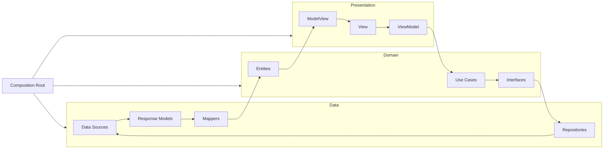

# MoviesFinder
A native macOS (12+) application to browse, group and sort movie data from the [TMDB API](https://developer.themoviedb.org/docs/getting-started).

---

## 🚀 Table of Contents

1. [Features](#features)
2. [Screenshots](#screenshots)
3. [Installation](#installation)
4. [Architecture](#architecture)  
   - [Clean Architecture](#clean-architecture)  
   - [MVVM (Presentation Layer)](#mvvm-presentation-layer)  
5. [Modularization (Swift Packages)](#modularization-swift-packages)  
6. [Layer Structure](#layer-structure)  
7. [Testing](#testing)  
8. [Build & Packaging](#build--packaging)  
9. [3rd-Party Libraries](#external--libraries)  

---
<a name="features"></a>
## ✨ Features

- **Movie Listing & Detail**  
  - Browse lists of movies fetched from TMDB  
  - Group by genre & sort by popularity, release date, rating, etc.  
  - Tap a “movie” to reveal their details

- **Status Bar Menu**  
  - Show/hide the main window  
  - Quit the app  
  - Quick-access list of movies & navigation to detail  

- **Welcome Screen**  
  - A first-launch welcome window with brief instructions  

- **Settings Window**  
  - Switch between light/dark/custom themes  
  - Toggle “Launch at Login” behavior  

- **Universal Binary**  
  - Runs natively on both Intel (x86_64) and Apple Silicon (arm64)  
---
<a name="screenshots"></a>
## 📸 Screenshots
<div align="center">


</div>

---

<a name="installation"></a>
## 📥 Installation
1. **Run the installer**  
   Double-click `MoviesFinder-signed.pkg`.  
2. **Handle the Gatekeeper alert**  
   — “MoviesFinder-signed.pkg cannot be opened because Apple cannot check it for malicious software.”  
   Click **OK**.  
3. **Open Security settings**  
   - **macOS 13+**: System Settings → Privacy & Security  
   - **macOS 12**: System Preferences → Security & Privacy → General  
4. **Allow the blocked installer**  
   Click **Open Anyway** under the “blocked” message.  
5. **Confirm and install**  
   Click **Open** when the alert reappears, then follow prompts.  
6. **Launch MoviesFinder**  
   Find it in `/Applications` and open.

---

<a name="architecture"></a>
## 🏗 Architecture

### Clean Architecture
Clean Architecture is used to keep layers independent and testable:



- **Composition Root**
  - Central point where dependencies are wired together and application bootstrapping occurs  
- **Domain**  
  - Core business rules: Entities, Use Cases, Interfaces, Response Models  
  - Framework-agnostic  
- **Data**  
  - Implements repository protocols  
  - Contains data sources (TMDB API client), mappers, and repositories  
- **Presentation**  
  - UI logic and state management using MVVM  
  - Independent of network or persistence details  


### MVVM (Presentation Layer)
The Presentation layer uses **Model–View–ViewModel**:

- **View**  
  - Declarative SwiftUI screens (list, detail, status bar menu, welcome, settings)  
- **ViewModel**  
  - `@Published` properties, handles UI actions, invokes domain use cases  
- **ModelView**  
  - Structures tailored for view display (entities, texts, etc.)  

---

<a name="modularization-swift-packages"></a>
## 📦 Modularization (Swift Packages)

| Package           | Purpose                                                    |
|-------------------|------------------------------------------------------------|
| **Theme**         | Design system: colors, fonts, images, layout             |
| **UIComponents**  | Reusable SwiftUI components (cards, buttons, badges, etc.)         |
| **Utils**         | Generic helpers & extensions                               |
| **NetworkSystem** | Networking engine: requests, response parsing, error handling |
| **MVVM Core**     | Base protocols & types for MVVM |

---

<a name="layer-structure"></a>
## 📐 Layer Structure

### Domain  
- **Factories** — `MovieListFactory`, etc.

### Data  
- **Data Sources** — `ApiDataSourceMovies` (TMDB API)  
- **Repositories** — `MoviesRepository`, etc.  
- **Mappers** — Converting response models → Entities
  
### Domain  
- **Entities** — `MovieDetailsEntity`, `GenreEntity`, etc.  
- **Use Cases** — `GetMoviesList`, `GetGenresList` , etc. 
- **Interfaces** — `MovieRepositoryProtocol`  
- **Response Models** — DTOs matching TMDB JSON  

### Presentation  
- **View** — SwiftUI views (list, detail, status bar, welcome, settings)  
- **ViewModel** — State management, user actions → use cases  
- **ModelView** — View-specific data formatting  

---
<a name="testing"></a>
## 🧪 Testing

- **Domain Tests**  
  - Validate business logic in use cases  
- **Data Layer Tests**  
  - Mock TMDB responses, verify mapping to Entities  
- **ViewModel Tests**  
  - Assert published states & interactions  

---
<a name="build--packaging"></a>
## 🛠 Build & Packaging

A Bash driver **`scripts/main.sh`** automates:

1. **Build & Archive** universal binary  
2. **Extract** the `.app`  
3. **Package** into a signed `.pkg`  
4. **Clean up** intermediate files  

```bash
# Make scripts executable:
chmod +x scripts/*.sh

# Generate signed installer:
bash scripts/main.sh
```
---

<a name="external--libraries"></a>
## 📚 3rd-Party Libraries

- **LaunchAtLogin**  
  Enables “Launch at Login” functionality in the Settings window.  
  Repository: https://github.com/sindresorhus/LaunchAtLogin-Legacy  


